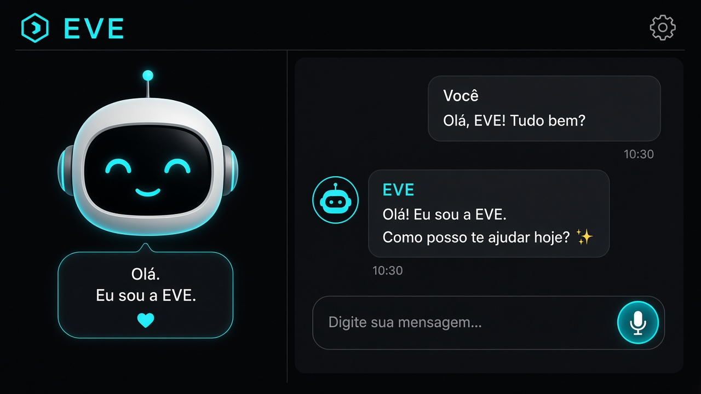
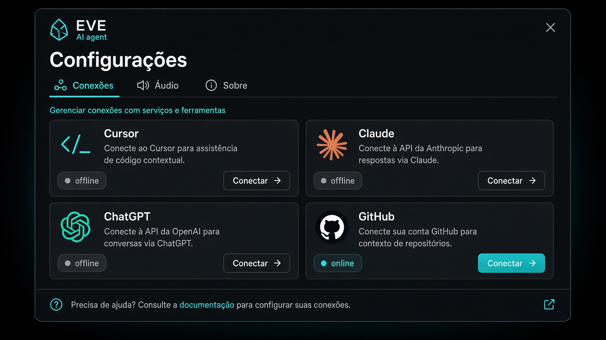
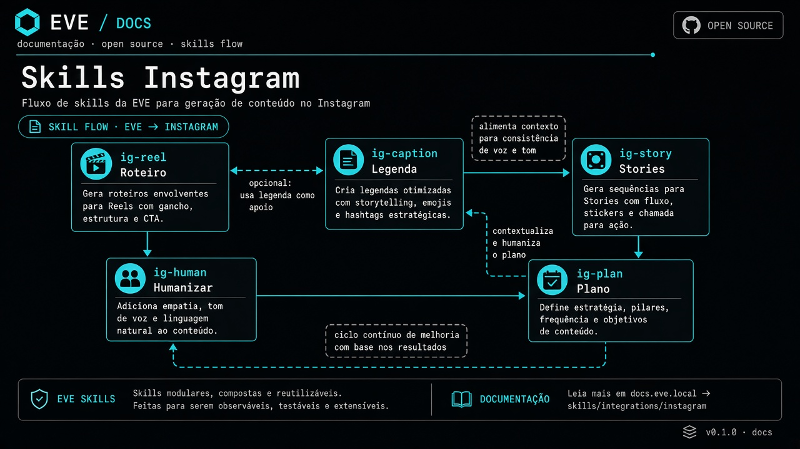

# EVE (`@eve/code`)

Agente CLI open-source no seu PC — conversa, voz, memória e ações locais (arquivos, terminal, apps).



## O que é

A **EVE** é um agente pessoal que roda no Windows. Você fala ou digita; ela responde no chat e, quando precisa, mexe no PC de verdade.

Dados sensíveis (keys, memória, logs) ficam em `~/.eve/` na **sua máquina** — não vão pro repositório.

## Prints

### Interface


- Personagem animado + bolha de fala  
- Chat com histórico  
- Mic no composer (toque → fale → toque de novo)  
- Configurações no ícone de engrenagem  

### Conexões



Em **Config → Conexões** você liga as APIs que quiser usar (chat e ações no PC). As keys ficam só no seu computador.

### Skills (Instagram)



Skills `ig-*` em `skills/instagram/` — roteiros, legendas, stories, humanização, plano, etc.  
Elas são **opcionais**: a EVE usa quando você pede conteúdo pra Instagram. Nada é postado sem você confirmar.

## Como funciona (fluxo)

```text
Você (texto ou mic)
        │
        ▼
   App / CLI EVE
        │
        ├─ chat simples + API de chat        → resposta rápida
        ├─ pedido pra mexer no PC            → agente local (tools)
        └─ voz ligada (veio do mic)          → TTS (Piper / Windows)
```

1. **Entrada** — digite no chat ou use o mic (Web Speech + Whisper local de fallback).  
2. **Roteamento** — conversa leve usa API de chat se houver chave; pedidos de PC usam o agente local.  
3. **Chat** — respostas no painel; edições de arquivo saem como spoiler com ícone da linguagem.  
4. **Memória** — fatos em `~/.eve/brain.json` (local).

## Instalação

**Requisitos:** Node.js **22.13+**, Windows (voz/tela).

```bash
git clone https://github.com/oftcer/eve.git
cd eve
npm install
npm start
```

Comando global:

```bash
npm link
eve
```

Variáveis opcionais (copie `.env.example` → `.env` — o `.env` **não** é commitado):

```bash
CURSOR_API_KEY=
OPENAI_API_KEY=
ANTHROPIC_API_KEY=
```

## Comandos CLI

| Comando | Ação |
|--------|------|
| `/conectar` | Conectar conta do agente local |
| `/status` | Status dos canais |
| `/voz on\|off` | Voz |
| `/tela` | Abrir painel visual |
| `/cerebro` | Ver memórias |
| `/lembrar …` | Guardar fato |
| `/parar` | Cancelar tarefa |
| `/sair` | Sair |
| `/ajuda` | Ajuda |

## Estrutura do projeto

```text
bin/            CLI (eve)
src/            núcleo (agente, voz, STT, conexões)
public/         UI do painel
desktop/        app Electron opcional
skills/         skills Instagram (ig-*)
docs/           prints e documentação visual
```

## Privacidade

- Sem e-mails, tokens ou keys no código.  
- `.env`, `~/.eve/` e `.cursor/` locais estão no `.gitignore`.  
- Autor: **Oftcer**.

## Licença

[MIT](./LICENSE) © 2026 Oftcer
